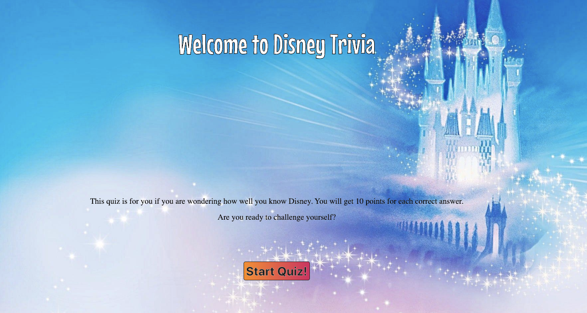
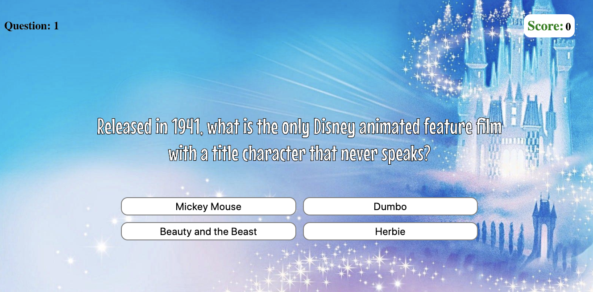

# Carol Cui-project1

### Disney Trivia Game

#### Homepage looks like:


#### Game container looks like:


#### Installation Instructions:

The game should able to be played in any web browser and devices. 
Once the game started, player will get 10 points if answered right, otherwise no point will be applyed to the score board.

#### Used following technologies:

- HTML
- CSS
- Javascript

#### The approach taken:

- start the game by press the Start button
- show the questions with answer container for 10 total questions
- gain 10 point by answering the correct answer
- if the user doesn't get 100 points, user can start over the game by clicking 'Try Again' button.
- if the user score 100 points, will show winner message.

#### Improvement in the future:

- will upgrade the styling for the game.
- use modal instead of alert message for showing correct or wrong answers.
- will add timer.
- add show top three scores table/box.

#### Unsolved problems:

- Could not solve the function for Timer functionality which I want the Timer to be count down 10 sec for each questions.

```
let sec = 10;
function countDown() {
	let showTimer = document.querySelector('.timer');
	showTimer.innerText = sec;
    let timer = setTimeout(timeIt, 1000);
    function timeIt () {
        sec = sec-1;
        // showTimer.innerText = sec;
    }
	if (sec < 1) {
        clearTimeout(timer);
    }

}
```

[Please click here if you are ready to play!](https://ylcarolcui.github.io/carolcui-project1/)
